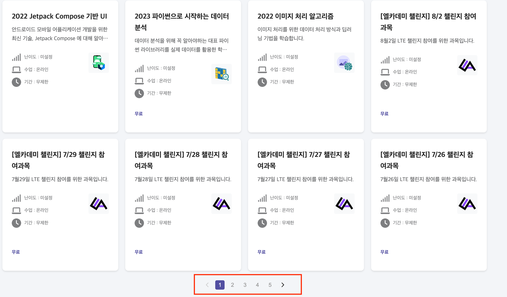

## 화면 구조




## 기술 스택

Next.js
TypeScript
styled-components
axios

## 폴더 구조

src/
├── components/
│ ├── common/
│ │ ├── SearchArea.tsx
│ │ ├── Pagination.tsx
│ │ └── ...
│ ├── courseCardContainer/
│ └── chipFilter/
├── lib/
│ ├── api/
│ │ └── fetch-course-list.ts
│ └── utils/
│ └── searchParamGenerator.ts
└── pages/
└── index.tsx

## 디렉토리 구조

1. components/
   공통 컴포넌트 및 페이지 컴포넌트를 담당합니다.
   - common
     공통 컴포넌트(Input, Pagination, ChipFilter)등, 공통으로 사용되는 컴포넌트를 정의합니다.
2. lib/
   공통 라이브러리 및 API 호출 함수를 담당합니다.
   - api
     서버에서 데이터를 가져오는 함수를 정의합니다.
   - utils
     공통으로 사용되는 로직, 유틸 함수를 정의하여 사용합니다.
3. pages/
   데이터를 호출하여 사용자에게 보요주는 역할을 담당합니다.
4. types/
   API Response, 공통 타입 을 정의합니다
5. **tests**/
   테스트 코드를 작성합니다. **test** 내부의 구조는 src/ 내부와 동일하게 작성합니다.

```
export const getServerSideProps = async (context: GetServerSidePropsContext) => {
 const params = searchParamGenerator(context.query as Record<string, string|string[]>);
 const courseList = await fetchCourseList(params);
 return {
   props: {
     courseList,
   }
 }
```

fetch-course-list.ts

```
  const title = query.get('keyword');
 const price = query.getAll('price').map((param) => {
   return { enroll_type: 0, is_free: param === 'free' ? true : false };
 });
 const filter_conditions = JSON.stringify({
   $and: [{ title: `%${title ? title : ''}%` }, { $or: price }],
 });
  try {
   const response = await fetch(url, {method: "GET", next: {revalidate:5}})
   if(!response.ok) {
     throw new Error();
   }

   return await response.json();
 }catch(err) {
   return {
     courses: [],
     course_count: 0,
   };
 }
```

## 개선 가능한 부분

1. 상태 관리 최적화
   현재는 URL 쿼리를 통해 상태를 관리하고 있으나, 복잡한 상태 관리가 필요한 경우 Recoil이나 Redux 도입 고려
2. 성능 최적화
   현재는 프로젝트 규모가 크지 않고 상태 관리가 많지 않기 때문에 useMemo, useCallback과 캐싱을 사용하는 것이 오히려 메모리 낭비로 이어질 수 있다고 판단되어 사용하지 않았습니다.
   프로젝트의 규모가 커지고 기능요구사항이 많아진다면 useMemo,useCallback 사용으로 캐싱을 통한 성능 최적화를 고려해야 할 것 같습니다.
3. 타입 안정성 강화
   현재 API Response의 일부분만 사용하여 Card를 생성하였습니다. 그러다보니, Card의 중간 부분에 아무것도 보이지 않아 빈 공간이 생기고 있습니다.
   이를 해결하기 위해 향후, 추가적인 API Response를 사용하여 Card를 생성하는 방법을 고려해볼 수 있습니다.
   그로 인한 API Response의 타입 정의 추가 및 공통 타입 정의 추가가 필요할 것 같습니다.
4. 공통 타입 정의 추가
   현재는 ErrorBoundary 처리를 하지 않고 있습니다. 사용자의 UX를 강화하기 위해서, ErrorPage, ErrorMessage 등 다양한 에러 핸들링을 통해 사용자의 경험을 강화해야한다고 생각합니다.
